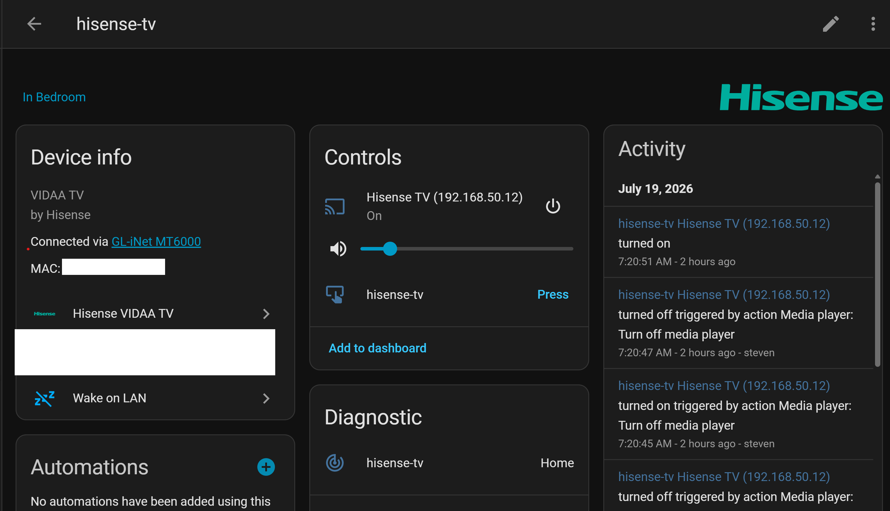

# Hisense VIDAA TV Integration for Home Assistant

A custom Home Assistant integration for Hisense TVs running VIDAA OS.

This integration connects **directly** to the TV's internal MQTT broker (SSL port `36669`) using generic certificates, meaning you do **not** need to configure a Mosquitto MQTT bridge at the system level.

## Features

- **Direct Secure Connection**: Connects straight to the TV over SSL.
- **Easy UI Setup**: Fully configured via Home Assistant Config Flow.
- **PIN Authentication**: Automatic on-screen challenge PIN display and input within the integration setup flow.
- **Standby Power Control**: Power on/off the TV using secure MQTT keys.
- **Media Player Entity**:
  - Power control.
  - Volume adjust, step, and mute.
  - Source selector (combines HDMI/AV inputs and installed applications).
  - Media Browser for launching applications.
  - Real-time updates via local push.
- **Robust Connection Handlers**:
  - Non-blocking startup ensures the integration loads even if the TV is off.
  - Automatic background token refresh on session expiration.
  - Dynamic token persistence directly to Config Entry to survive restarts.



## Installation

1. Copy the `hisense_vidaa` directory to your Home Assistant `custom_components/` directory (e.g. `/config/custom_components/hisense_vidaa`).
2. Place the TV's SSL connection certificate (`cert.pem`) and private key (`key.pem`) inside the `certs/` subdirectory:
   ```text
   custom_components/hisense_vidaa/certs/cert.pem
   custom_components/hisense_vidaa/certs/key.pem
   ```
3. Restart Home Assistant.
4. Go to **Settings -> Devices & Services -> Add Integration** and search for **Hisense VIDAA TV**.
5. Enter the TV's IP address and (optional) MAC address.
6. Enter the 4-digit PIN code displayed on the TV screen to complete the setup.

## Credits & Acknowledgments

This native integration adapts the foundational reverse-engineering and secure pairing logic discovered by the open-source community. Special thanks to:

* **Nika Gerson Lohman ([@nikagl](https://github.com/nikagl))**: For creating the original `hisense.py` script architecture, handling the complex SSL handshake mechanics, and proving the concept for the RemoteNOW-style dynamic PIN authentication flow.
* **[@Krazy998](https://github.com/Krazy998) & Contributors**: For their collaborative efforts on the `mqtt-hisensetv` repository, which served as a crucial repository of knowledge for decoding the newer VIDAA OS MQTT communication barriers.
