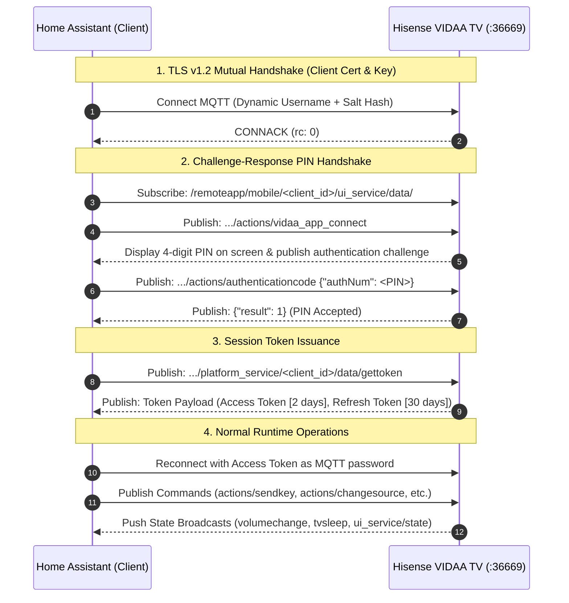

# Hisense VIDAA TV Integration for Home Assistant

[](https://github.com/hacs/default)
[](https://github.com/stevene1919/hisense_vidaa/actions/workflows/validate.yml)
[](https://github.com/stevene1919/hisense_vidaa/actions/workflows/lint.yml)
[](https://github.com/stevene1919/hisense_vidaa/releases)

[](https://my.home-assistant.io/redirect/hacs_repository/?owner=stevene1919&repository=hisense_vidaa&category=integration)

A custom Home Assistant integration for Hisense TVs running modern VIDAA OS.

This integration connects **directly** to the TV's internal MQTT broker (SSL port `36669`) using client certificates, without requiring external Mosquitto bridges or system-level configuration.

## 🧭 Supported Authentication Profiles

This integration automatically detects and natively supports all generations of Hisense smart TVs:

| TV Generation / Firmware | Auth Profile | Authentication Model | Pairing Method |
| :--- | :--- | :--- | :--- |
| **Modern VIDAA OS (2024+ / U7, U8, Q0704+)** | `modern` | **Modern VIDAA 2.0** (`libmqttcrypt` XOR mask) | 4-Digit Screen PIN (`actions/vidaa_app_connect`) |
| **Standard VIDAA OS (2018–2023 / U4, U5, U6)** | `remotenow` | **RemoteNOW Dynamic** (`his$<timestamp>`) | 4-Digit Screen PIN (`actions/vidaa_app_connect`) |
| **Legacy Hisense / Older VIDAA (Pre-2022)** | `legacy` | **Legacy Static** (`hisenseservice`) | Instant Setup (No PIN / Static Credentials) |

> [!TIP]
> **Auto-Detection (`auto`)**: The integration automatically probes your TV's MQTT broker capabilities during setup and selects the optimal authentication handshake for your specific firmware.
>
> You can also run the built-in diagnostic probe from the command line:
> ```bash
> python3 test_client.py ping --ip <YOUR_TV_IP>
> ```

---

## ✨ Features

- **Multi-Generation Authentication**: Native support for Modern VIDAA 2.0 (XOR hashing), Standard RemoteNOW dynamic pairing, and Legacy Static credentials (`hisenseservice`).
- **Flexible Certificate Formats & Auto-Extraction**: Native support for split PEM pairs (`.pem`, `.crt`, `.key`) and direct PKCS#12 keystore archives (`.p12`, `.pfx` e.g. `client_mobile_android.p12`, `rcamobile.p12`) with automatic key/cert extraction.
- **Optional Root CA Validation**: Configurable root CA verification (`ca_cert` / `remote_ca.pem`) with `CERT_NONE` default matching official VIDAA app behavior.
- **Direct Secure Connection**: Native SSL communication directly to port `36669` with TLS bypass support for unencrypted brokers and automatic fallback routing.
- **Security Hardened**: Protected against XML Entity Expansion (Billion Laughs) and DTD injection using `defusedxml` parsers during UPnP/DLNA discovery.
- **Automatic TV Clock Synchronization**: Extracts HTTP `Date` headers from the TV's internal UPnP/DLNA services on candidate ports (`38400` and `18400`) to prevent hash mismatches during clock drift.
- **Native Reauthentication & Reconfigure**: Full UI support for Home Assistant re-auth notifications, reconfigure actions, and automated PIN sanitization.
- **Accurate State & Standby Handling**: Entities cleanly report `state = "off"` (with `available = True`) during standby, keeping UI power toggles and automations fully functional.
- **Subnet-Aware Wake-on-LAN**: Broadcasts magic packets to both the target `/24` subnet directed broadcast and `255.255.255.255` for reliable cross-VLAN wake-up.
- **Dedicated Remote Entity (`remote`)**:
  - Full remote control platform (`remote.<tv_name>`).
  - Key alias resolution (`up`, `down`, `home`, `menu`, `back`, `ok_long`, `mute_long`, `audio_only`, `screen_off`, `netflix`, `youtube`, etc.).
  - Direct command dispatching with `hold_secs` duration, repeat, and delay controls.
- **Media Player Entity (`media_player`)**:
  - Power toggle and standby control.
  - Volume adjustment, stepping, and mute toggle.
  - Configurable media transport controls (`PLAY`, `PAUSE`, `STOP`, `NEXT_TRACK`, `PREVIOUS_TRACK`, `PLAY_MEDIA`) — toggle via options (works natively in streaming apps and via HDMI-CEC on connected devices).
  - Deep link URI schemes (`netflix://`, `youtube://`, `https://...`) and numeric / decimal channel tuning (e.g. `"70"`, `"7.1"` sending `KEY_CHANNELDOT`).
  - Active HDMI-CEC connected device tracking (`connected_device`) and Live TV channel metadata (`channel_name`, `channel_number`).
  - Unified input source selector with configurable app inclusions (HDMI, TV, AV, Netflix, YouTube, Plex, etc.).
  - Dynamic app CDN artwork in the media player card for the currently active app.
  - Instant local push updates for volume and power state across multiple firmware topic variants.
- **Sensors & Diagnostic Entities**:
  - **Active Source sensor** (`sensor.{tv}_active_source`): tracks current physical input or app with available/connected sources and HDMI-CEC device name as attributes.
  - **Active App sensor** (`sensor.{tv}_active_app`): tracks the running Smart TV app with installed app list as attributes.
  - **Audio Output sensor** (`sensor.{tv}_audio_output`): detects whether audio is outputting through `"TV Speakers"`, external receiver (`"ARC / eARC"`), or is muted.
  - **MQTT Connected binary sensor** (`binary_sensor.{tv}_mqtt_connected`): real-time broker connectivity state.
  - Auth profile, token expiry, and other diagnostic sensors.
  - **Sync Clock button** (`button.{tv}_sync_clock`): manual TV clock synchronization via UPnP/DLNA.
  - Refresh token and force reconnect diagnostic buttons.
  - Native Home Assistant Diagnostics integration (`diagnostics.py`) with sensitive token and IP/MAC redaction.
  - In-UI Repairs issue when certificates are missing or unreadable.
- **Full Options Flow**:
  - Configure device behavior via **Settings → Devices & Services → Configure** without re-pairing.
  - Toggle: dedicated remote entity, Wake-on-LAN, Smart TV app listing in sources, **media transport controls**, and SSL mode.
- **HACS & CI Compliant**:
  - Fully structured for HACS with `hacs.json` and `integration_type: "device"`.
  - Dual CI validation pipelines (`hassfest` + `hacs/action`) for Home Assistant standards compliance.
- **Zero-Duplication CLI Tools**: Two standalone diagnostic scripts sharing 100% backend logic with the integration:
  - [`test_client.py`](test_client.py) — auth probe, pairing, firmware detection, app launcher, WoL, and GitHub issue report generation.
  - [`debug_tv.py`](debug_tv.py) — live state dump, real-time MQTT event monitoring, keypress/app/source control, and clock drift inspection.

---

## 📱 Lovelace Remote Cards & Dashboard Examples

Ready-to-use Lovelace dashboard remote configurations are available in the [`examples/`](examples/) directory:

1. **[Australian Physical Remote (EN2G30H)](examples/lovelace-australian-remote-card.yaml)**:
   - Pixel-accurate recreation of the physical 12-app Australian remote control (`button-card`).
   - Includes custom SVGs/badges for Netflix, YouTube, Prime Video, Disney+, Stan, Kayo, Binge, Foxtel, ABC iview, SBS On Demand, 7plus, 9Now, and 10 play.
   - Dual vertical pill rockers for Volume (`+`/`-`) and Channel (`+`/`-`), full D-pad wheel with center OK, and 12-key numpad.

2. **[Classic Free-to-Air Remote (No Smart Apps)](examples/lovelace-classic-remote-card.yaml)**:
   - Traditional TV remote layout designed for broadcast TV and clean media setups without streaming app clutter.
   - Dedicated Power, Input cycle, Subtitle, Teletext, Guide/EPG, Channel List, Volume/Channel rockers, Full Numpad, and Color Keys.

3. **[Standard Modular Button Card Remote](examples/lovelace-button-card-remote.yaml)**:
   - Modular vertical stack layout using standard `custom:button-card`.

4. **[Android TV Card Profile](examples/lovelace-android-tv-card.yaml)**:
   - Pre-configured profile for `custom:android-tv-card`.

5. **[Classic TV Card Profile](examples/lovelace-tv-card.yaml)**:
   - Compact profile for `custom:tv-card`.

---

## 🌐 Network Requirements & Best Practices

> [!IMPORTANT]
> **Internet Connectivity Required**: The TV **must have active internet connectivity and unblocked DNS resolution** for pairing, token exchange, and token refresh to succeed.
> 
> If the TV is isolated on an offline IoT VLAN or blocked by network-level ad blockers / firewalls (e.g., AdGuard Home, Pi-hole), VIDAA OS will refuse to complete the pairing handshake or refresh tokens. Ensure the TV has outbound WAN access during pairing and token renewal.

### 📌 Recommended Network Setup

1. **Static DHCP Reservation (Fixed IP)**:
   - It is strongly recommended to set a **static DHCP reservation** on your router/gateway for the TV's MAC address.
   - While the integration supports dynamic IP migration via hardware MAC tracking, a fixed IP guarantees uninterrupted MQTT broker communication, avoids reconnect delays during lease renewals, and prevents connection drops across TV power cycles.

2. **Wired Ethernet for Reliable Wake-on-LAN (WoL)**:
   - For dependable Wake-on-LAN (powering the TV on from standby), connect the TV via a **wired Ethernet cable** rather than Wi-Fi whenever possible.
   - Many Hisense / VIDAA TV models power down the Wi-Fi radio entirely in deep standby / eco mode to save power, whereas the Ethernet controller remains in low-power listening state for magic packets.
   - Ensure Wake-on-LAN is enabled in your TV menu (**Settings → Network / System → Advanced Settings → Wake on LAN / Power on by Apps**), and toggle **Enable Wake-on-LAN** in the integration options (**Settings → Devices & Services → Configure**).

---

## 🔒 SSL Certificate Setup

VIDAA OS requires a client SSL certificate and private key to communicate with port `36669`. Certificates are excluded from this repository and must be provided locally.

The integration supports both **extracted `.pem` / `.crt` / `.key` files** and **direct PKCS#12 bundles (`.p12` / `.pfx`)**:

1. Place your certificate and private key files in `/config/certs/`, `/config/ssl/`, `/ssl/`, or `custom_components/hisense_vidaa/certs/`:

| Format / Profile | Firmware / Generation | Certificate / Bundle Filename | Private Key Filename |
| :--- | :--- | :--- | :--- |
| **PKCS#12 Bundle (Auto-Extracted)** | Any Modern VIDAA / RemoteNOW | `client_mobile_android.p12` or `rcamobile.p12` | *(Bundled in .p12)* |
| **VIDAA 2.0 (Modern PEM)** | VIDAA U7 / U8 / OS 7.x+ (`Q0704`+) | `vidaa_2024_cert.pem` or `vidaa_client.pem` | `vidaa_2024_key.pem` or `vidaa_client.key` |
| **RemoteNOW (Standard PEM)** | VIDAA U4 / U5 / U6 (2018–2023) | `remotenow_2018_cert.pem` or `hisense.crt` | `remotenow_2018_key.pem` or `hisense.key` |
| **Generic / Custom PEM** | Standard fallback for any profile | `cert.pem` | `key.pem` |
| **Optional Root CA** | Optional TLS server verification | `remote_ca.pem` or `RemoteCA.crt` | *(Public root CA)* |

---

## 🔬 Under the Hood: VIDAA Protocol & Cryptographic Architecture

The Hisense VIDAA smart TV runs an internal MQTT broker listening on TLS port `36669`. Reverse-engineering of `libmqttcrypt.so` and the official VIDAA Android client reveals the following multi-tier challenge-response architecture:


```mermaid
sequenceDiagram
    autonumber
    participant HA as Home Assistant (Client)
    participant TV as Hisense VIDAA TV (:36669)
    
    Note over HA,TV: 1. TLS v1.2 Mutual Handshake (Client Cert & Key)
    HA->>TV: Connect MQTT (Dynamic Username + Salt Hash)
    TV-->>HA: CONNACK (rc: 0)
    
    Note over HA,TV: 2. Challenge-Response PIN Handshake
    HA->>TV: Subscribe: /remoteapp/mobile/<client_id>/ui_service/data/#
    HA->>TV: Publish: .../actions/vidaa_app_connect
    TV-->>HA: Display 4-digit PIN on screen & publish authentication challenge
    HA->>TV: Publish: .../actions/authenticationcode {"authNum": <PIN>}
    TV-->>HA: Publish: {"result": 1} (PIN Accepted)
    
    Note over HA,TV: 3. Session Token Issuance
    HA->>TV: Publish: .../platform_service/<client_id>/data/gettoken
    TV-->>HA: Publish: Token Payload (Access Token [2 days], Refresh Token [30 days])
    
    Note over HA,TV: 4. Normal Runtime Operations
    HA->>TV: Reconnect with Access Token as MQTT password
    HA->>TV: Publish Commands (actions/sendkey, actions/changesource, etc.)
    TV-->>HA: Push State Broadcasts (volumechange, tvsleep, ui_service/state)
```

### 1. Dual-Tier Authentication Formulas
The TV's internal MQTT broker (`libmqttcrypt`) enforces a strict client ID whitelist format during initial pairing: `${mac}$his${md5_prefix}_vidaacommon_001`. The suffix must be `_vidaacommon_001` or the connection is immediately rejected (`rc: 2`).

#### 🟢 Generation 2: Modern VIDAA 2.0 (`libmqttcrypt.so` / Firmware `Q0704`+)
- **Pattern:** `PATTERN = "38D65DC30F45109A369A86FCE866A85B"`
- **Client ID:** `f"{mac}$his${md5(f'{PATTERN}${mac}')[:6]}_vidaacommon_001"`
- **Username:** `f"his${timestamp ^ 6239759785777146216}"` *(XOR 64-bit mask `0x5689ab4102ef1908`)*
- **Cross-Sum:** `sum_digit = sum(int(d) for d in str(timestamp)) % 10`
- **Modern Salt:** `h!i@s#$v%i^d&a*a` *("hisvidaa")*
- **Password Hash:** `md5(f"{timestamp}${md5(f'his{sum_digit}h!i@s#$v%i^d&a*a')[:6]}").upper()`

#### 🟡 Generation 1: RemoteNOW (Standard / Firmware `P1027` and older)
- **Client ID:** `f"{mac}$his${md5(f'{PATTERN}${mac}')[:6]}_vidaacommon_001"`
- **Username:** `f"his${timestamp}"`
- **Standard Salt:** `h*i&s%e!r^v0i1c9` *("hiserv0i1c9")*
- **Password Hash:** `md5(f"{timestamp}${md5(f'his{sum_digit}h*i&s%e!r^v0i1c9')[:6]}").upper()`

### 2. Session Token Lifecycle & Auto-Renewal
- **Access Token (`accesstoken`):** Valid for **48 hours (2 days)**. Used directly as the MQTT password for all runtime commands and queries.
- **Refresh Token (`refreshtoken`):** Valid for **30 days**. When the access token expires or connection receives `rc: 4`/`5`, the integration connects using the refresh token to topic `platform_service/data/tokenissuance`, requests a new 48-hour access token, and persists it to Home Assistant's config entries.

### 3. MQTT Topic Hierarchy Reference

| Topic Path | Direction | Purpose |
| :--- | :--- | :--- |
| `/remoteapp/tv/ui_service/{client_id}/actions/vidaa_app_connect` | `Publish` | Initiate pairing handshake & trigger on-screen PIN |
| `/remoteapp/tv/ui_service/{client_id}/actions/authenticationcode` | `Publish` | Submit user-entered 4-digit PIN |
| `/remoteapp/tv/ui_service/{client_id}/actions/authenticationcodeclose` | `Publish` | Dismiss PIN modal on TV screen |
| `/remoteapp/tv/platform_service/{client_id}/data/gettoken` | `Publish` | Request initial access/refresh token pair |
| `/remoteapp/tv/remote_service/{client_id}/actions/sendkey` | `Publish` | Dispatch remote keypress (e.g. `KEY_POWER`, `KEY_HOME`) |
| `/remoteapp/tv/ui_service/{client_id}/actions/changesource` | `Publish` | Switch input source (`{"sourceid": "HDMI1"}`) |
| `/remoteapp/tv/ui_service/{client_id}/actions/launchapp` | `Publish` | Launch installed Smart TV application |
| `/remoteapp/tv/ps_service/{client_id}/actions/changevolume` | `Publish` | Set absolute volume level (`0`–`100`) |
| `/remoteapp/mobile/{client_id}/ui_service/data/authentication` | `Subscribe` | Receive TV pairing challenge response |
| `/remoteapp/mobile/{client_id}/platform_service/data/tokenissuance` | `Subscribe` | Receive issued / refreshed authentication tokens |
| `/remoteapp/mobile/broadcast/ui_service/state` | `Subscribe` | Real-time push notifications for TV power and UI state |
| `/remoteapp/mobile/broadcast/platform_service/actions/volumechange`| `Subscribe` | Real-time push notifications for volume and mute changes |

---

## 🏗 Codebase Architecture

The integration is built around modular, single-responsibility components:

| Module | Responsibility |
| :--- | :--- |
| [`crypto.py`](custom_components/hisense_vidaa/crypto.py) | Dynamic authentication hashing, salt matrices, XOR timestamp generation, and certificate path resolution. |
| [`discovery.py`](custom_components/hisense_vidaa/discovery.py) | UPnP/SSDP XML device descriptor parser and mDNS Zeroconf network discovery helpers. |
| [`const.py`](custom_components/hisense_vidaa/const.py) | Centralized constants, key aliases, and authentication profile definitions. |
| [`client.py`](custom_components/hisense_vidaa/client.py) | Core asynchronous MQTT client lifecycle, challenge-response handshake, and event dispatching. |

---

## 🧪 Testing & Diagnostics

The integration ships with two standalone CLI tools that share 100% of the backend logic with the Home Assistant integration — no mocking, no stubs.

---

### 🔬 `test_client.py` — Auth Probe & Pairing Tool

[`test_client.py`](test_client.py) is focused on **authentication, pairing, and issue reporting**. Use it when setting up for the first time, debugging auth failures, or generating a GitHub diagnostic report.

#### 1. Generate GitHub Issue Diagnostic Report (`report`)
Generates a pre-formatted Markdown diagnostics block with hardware details, firmware profile, and multi-tier authentication capabilities ready to paste directly into GitHub issues:
```bash
python3 test_client.py report --ip <TV_IP>
```

#### 2. Diagnostic Probe & Firmware Detection (`ping`)
Tests TCP port reachability, TLS handshake, broker response, and multi-tier auth capabilities — suggests which integration profile your firmware requires:
```bash
python3 test_client.py ping --ip <TV_IP>

# Test specific authentication profile:
python3 test_client.py ping --ip <TV_IP> --profile modern
```

#### 3. Test Raw SSL/TLS Connection & Cert Validity (`test-ssl`)
Verifies TLS cipher negotiation and certificate validity without initiating pairing:
```bash
python3 test_client.py test-ssl --ip <TV_IP>
python3 test_client.py test-ssl --ip <TV_IP> --profile modern
python3 test_client.py test-ssl --ip <TV_IP> --cert /path/to/cert.pem --key /path/to/key.pem
```

#### 4. Test Pairing & Retrieve Tokens (`auth`)
Initiates the full challenge handshake, prompts for the on-screen PIN, and saves tokens to `credentials.json`:
```bash
python3 test_client.py auth --ip <TV_IP>
python3 test_client.py auth --ip <TV_IP> --profile modern
```

#### 5. Test Token Refresh (`refresh`)
Tests synchronous renewal of the 2-day access token using the 30-day refresh token:
```bash
python3 test_client.py refresh
```

#### 6. Listen to Real-Time TV Events (`listen`)
Subscribes to live state changes, volume updates, source list, and app list:
```bash
python3 test_client.py listen
```

#### 7. Send Remote Control Keys (`send-key`)
Dispatches a keypress directly to the TV:
```bash
python3 test_client.py send-key KEY_VOLUMEUP
python3 test_client.py send-key KEY_POWER
```

---

### 🛠️ `debug_tv.py` — Live Runtime Debugger

[`debug_tv.py`](debug_tv.py) is focused on **live runtime interaction and state inspection** — ideal for debugging a paired TV, testing commands, monitoring MQTT event streams, or checking clock drift. It reads credentials automatically from `credentials.json`.

```bash
# Dump current state, sources, apps, and volume:
python3 debug_tv.py --dump-state

# Continuously stream live MQTT events from the TV:
python3 debug_tv.py --monitor

# Send a keypress:
python3 debug_tv.py --send-key KEY_HOME
python3 debug_tv.py --send-key KEY_VOLUMEUP

# Launch an app by name or App ID:
python3 debug_tv.py --launch-app Netflix
python3 debug_tv.py --launch-app YouTube

# Switch input source:
python3 debug_tv.py --change-source HDMI1
python3 debug_tv.py --change-source TV

# Inspect UPnP Date header and calculate TV clock drift:
python3 debug_tv.py --sync-clock

# Override TV IP (default: from credentials.json):
python3 debug_tv.py --ip 192.168.50.12 --monitor

# Verbose debug logging:
python3 debug_tv.py --dump-state -v
```

> [!TIP]
> Run `python3 debug_tv.py` with no arguments to get a full state dump — equivalent to `--dump-state`. Useful as a quick sanity check after pairing.

---

## ⚙️ Installation & Home Assistant Setup

### Method 1: HACS (Recommended)

1. Click the button below to add this repository directly to HACS:

   [](https://my.home-assistant.io/redirect/hacs_repository/?owner=stevene1919&repository=hisense_vidaa&category=integration)

   *Or manually in HACS:*
   - Go to **HACS** -> **Integrations**.
   - Click the three dots in the top right -> **Custom repositories**.
   - Add `https://github.com/stevene1919/hisense_vidaa` with Category **Integration**.
   - Search for **Hisense VIDAA TV** and click **Download**.

2. Place your certificate files (`vidaa_2024_cert.pem` / `remotenow_2018_cert.pem` or `cert.pem`) into `/config/custom_components/hisense_vidaa/certs/` (or `/config/certs/` / `/config/ssl/`).
3. Restart Home Assistant.

### Method 2: Manual Installation

1. Download the latest release from the [Releases](https://github.com/stevene1919/hisense_vidaa/releases) page.
2. Copy the `custom_components/hisense_vidaa/` folder to your Home Assistant `/config/custom_components/` directory.
3. Place certificate files inside `/config/custom_components/hisense_vidaa/certs/`.
4. Restart Home Assistant.

---

### Pairing & Configuration

1. In Home Assistant, go to **Settings -> Devices & Services -> Add Integration**.
2. Search for **Hisense VIDAA TV**.
3. Enter the TV's IP address and select your **Authentication / Certificate Profile** (default: `Auto Detect (Recommended)`).
4. A 4-digit PIN code will appear on the TV screen — enter it into the prompt to complete setup.

---

## 🛠️ Custom Services & Example Automations

### 1. `hisense_vidaa.launch_app`
Launch an installed Smart TV application by name or direct URL:
```yaml
action: hisense_vidaa.launch_app
target:
  entity_id: media_player.living_room_tv
data:
  app: "Netflix" # e.g., Netflix, YouTube, Prime Video, Plex, Disney+
```

### 2. `hisense_vidaa.send_key`
Send fast single or repeated key commands:
```yaml
action: hisense_vidaa.send_key
target:
  entity_id: remote.living_room_tv_remote
data:
  key: "home"
  repeat: 1
  delay: 0.2
```

### 3. Native Remote Key Sequences (`remote.send_command`)
```yaml
action: remote.send_command
target:
  entity_id: remote.living_room_tv_remote
data:
  command:
    - home
    - right
    - right
    - ok
  delay_secs: 0.3
```

---

## 📱 Dashboard / Lovelace Card Examples

### Smart TV App Launcher Buttons
```yaml
type: horizontal-stack
cards:
  - type: button
    name: Netflix
    icon: mdi:netflix
    tap_action:
      action: perform-action
      perform_action: hisense_vidaa.launch_app
      target:
        entity_id: media_player.living_room_tv
      data:
        app: Netflix
  - type: button
    name: YouTube
    icon: mdi:youtube
    tap_action:
      action: perform-action
      perform_action: hisense_vidaa.launch_app
      target:
        entity_id: media_player.living_room_tv
      data:
        app: YouTube
  - type: button
    name: Prime Video
    icon: mdi:movie-open
    tap_action:
      action: perform-action
      perform_action: hisense_vidaa.launch_app
      target:
        entity_id: media_player.living_room_tv
      data:
        app: Prime Video
```

---

## 🔗 Legacy Firmware Alternatives & Related Projects

If your TV accepts static credentials or you are running older Hisense hardware:

* **[sehaas/ha_hisense_tv](https://github.com/sehaas/ha_hisense_tv)**: Home Assistant custom component for older firmware supporting static MQTT credentials.
* **[Krazy998/mqtt-hisensetv](https://github.com/Krazy998/mqtt-hisensetv/)**: Docker MQTT broker bridge and utilities for legacy models.

---

## 📋 Roadmap & Planned Features

See [`TODO.md`](TODO.md) for the active development backlog, planned features (e.g., dynamic model/firmware binding in device info), and network resilience investigations.

---

## Credits & Acknowledgments

This native integration adapts foundational reverse-engineering discoveries from the open-source community:

* **Nika Gerson Lohman ([@nikagl](https://github.com/nikagl))**: For creating the original `hisense.py` script architecture and proving the RemoteNOW-style dynamic PIN authentication flow.
* **[@Krazy998](https://github.com/Krazy998) & Contributors**: For collaborative research on the `mqtt-hisensetv` project decoding VIDAA OS MQTT communication.
