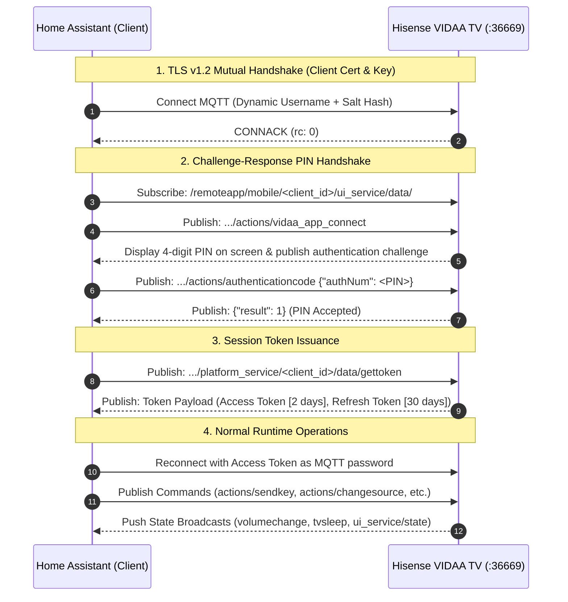

# Hisense VIDAA TV Integration for Home Assistant

[](https://github.com/hacs/default)
[](https://github.com/stevene1919/hisense_vidaa/actions/workflows/validate.yml)
[](https://github.com/stevene1919/hisense_vidaa/actions/workflows/lint.yml)
[](https://github.com/stevene1919/hisense_vidaa/releases)

[](https://my.home-assistant.io/redirect/hacs_repository/?owner=stevene1919&repository=hisense_vidaa&category=integration)

A custom Home Assistant integration for Hisense TVs running modern VIDAA OS.

This integration connects **directly** to the TV's internal MQTT broker (SSL port `36669`) using client certificates, without requiring external Mosquitto bridges or system-level configuration.

## 🧭 Supported Authentication Profiles

This integration automatically detects and natively supports all generations of Hisense smart TVs:

| TV Generation / Firmware | Auth Profile | Authentication Model | Pairing Method |
| :--- | :--- | :--- | :--- |
| **Modern VIDAA OS (2024+ / U7, U8, Q0704+)** | `modern` | **Modern VIDAA 2.0** (`libmqttcrypt` XOR mask) | 4-Digit Screen PIN (`actions/vidaa_app_connect`) |
| **Standard VIDAA OS (2018–2023 / U4, U5, U6)** | `remotenow` | **RemoteNOW Dynamic** (`his$<timestamp>`) | 4-Digit Screen PIN (`actions/vidaa_app_connect`) |
| **Legacy Hisense / Older VIDAA (Pre-2022)** | `legacy` | **Legacy Static** (`hisenseservice`) | Instant Setup (No PIN / Static Credentials) |

> [!TIP]
> **Auto-Detection (`auto`)**: The integration automatically probes your TV's MQTT broker capabilities during setup and selects the optimal authentication handshake for your specific firmware.
>
> You can also run the built-in diagnostic probe from the command line:
> ```bash
> python3 test_client.py ping --ip <YOUR_TV_IP>
> ```

---

## ✨ Features

- **Multi-Generation Authentication**: Native support for Modern VIDAA 2.0 (XOR hashing), Standard RemoteNOW dynamic pairing, and Legacy Static credentials (`hisenseservice`).
- **Direct Secure Connection**: Native SSL communication directly to port `36669` without external Mosquitto bridges.
- **Automatic TV Clock Synchronization**: Automatically extracts HTTP `Date` headers from the TV's internal UPnP/DLNA service to prevent hash mismatches during clock drift.
- **Native Reauthentication & Reconfigure**: Full UI support for Home Assistant re-auth notifications and reconfigure actions without needing to re-add the integration.
- **Accurate State & Standby Handling**: Entities cleanly report `state = "off"` (with `available = True`) during standby, keeping UI power toggles and automations fully functional.
- **Standby Power & Wake-on-LAN**: Power on/off via secure MQTT keys, with optional Wake-on-LAN magic packet support.
- **Dedicated Remote Entity (`remote`)**:
  - Full remote control platform (`remote.<tv_name>`).
  - Key alias resolution (`up`, `down`, `home`, `menu`, `back`, `netflix`, `youtube`, etc.).
  - Direct command dispatching with repeat and delay controls.
- **Media Player Entity (`media_player`)**:
  - Power toggle and standby control.
  - Volume adjustment, stepping, and mute toggle.
  - Playback controls (`PLAY`, `PAUSE`, `STOP`, `NEXT_TRACK`, `PREVIOUS_TRACK`, `PLAY_MEDIA`).
  - Unified input source selector with configurable app inclusions (HDMI, TV, AV, Netflix, YouTube, Plex, etc.).
  - Instant local push updates for volume and power state.
- **Full Options Flow**:
  - Configure device behavior via **Settings -> Devices & Services -> Configure** without re-pairing.
  - Toggle dedicated remote entity, Wake-on-LAN, and Smart TV app listing in sources.
- **Robust Connection Handlers**:
  - Non-blocking startup ensures Home Assistant boots cleanly even when the TV is powered off.
  - Exponential reconnect backoff (`min_delay=2, max_delay=30`) preventing thread storms.
  - Automatic background token refresh when 2-day session tokens expire (persisted directly to Config Entry).
- **Zero-Duplication CLI Diagnostic Tool**: Built-in test suite (`test_client.py`) sharing 100% of its backend logic with the Home Assistant integration code.

---

## 🌐 Important Network Requirement

> [!IMPORTANT]
> **Internet Connectivity Required**: The TV **must have active internet connectivity and unblocked DNS resolution** for pairing, token exchange, and token refresh to succeed.
> 
> If the TV is isolated on an offline IoT VLAN or blocked by network-level ad blockers / firewalls (e.g., AdGuard Home, Pi-hole), VIDAA OS will refuse to complete the pairing handshake or refresh tokens. We are investigating the exact cloud endpoints and domains required so specific whitelist rules can be documented in the future, but in the meantime, ensure the TV has outbound WAN access.

---

## 🔒 SSL Certificate Setup

VIDAA OS requires a client SSL certificate and private key to communicate with port `36669`. Certificates are excluded from this repository and must be provided locally.

1. Create a `certs/` directory inside `custom_components/hisense_vidaa/` (or place them in `/config/certs/` or `/config/ssl/`).
2. Place your certificate and private key files according to your TV generation:

| Profile | Firmware / Generation | Certificate Filename | Private Key Filename |
| :--- | :--- | :--- | :--- |
| **VIDAA 2.0 (Modern)** | VIDAA U7 / U8 / OS 7.x+ (`Q0704`+) | `vidaa_2024_cert.pem` | `vidaa_2024_key.pem` |
| **RemoteNOW (Standard)** | VIDAA U4 / U5 / U6 (2018–2023) | `remotenow_2018_cert.pem` | `remotenow_2018_key.pem` |
| **Generic / Custom** | Standard fallback for any profile | `cert.pem` | `key.pem` |

---

## 🔬 Under the Hood: VIDAA Protocol & Cryptographic Architecture

The Hisense VIDAA smart TV runs an internal MQTT broker listening on TLS port `36669`. Reverse-engineering of `libmqttcrypt.so` and the official VIDAA Android client reveals the following multi-tier challenge-response architecture:


```mermaid
sequenceDiagram
    autonumber
    participant HA as Home Assistant (Client)
    participant TV as Hisense VIDAA TV (:36669)
    
    Note over HA,TV: 1. TLS v1.2 Mutual Handshake (Client Cert & Key)
    HA->>TV: Connect MQTT (Dynamic Username + Salt Hash)
    TV-->>HA: CONNACK (rc: 0)
    
    Note over HA,TV: 2. Challenge-Response PIN Handshake
    HA->>TV: Subscribe: /remoteapp/mobile/<client_id>/ui_service/data/#
    HA->>TV: Publish: .../actions/vidaa_app_connect
    TV-->>HA: Display 4-digit PIN on screen & publish authentication challenge
    HA->>TV: Publish: .../actions/authenticationcode {"authNum": <PIN>}
    TV-->>HA: Publish: {"result": 1} (PIN Accepted)
    
    Note over HA,TV: 3. Session Token Issuance
    HA->>TV: Publish: .../platform_service/<client_id>/data/gettoken
    TV-->>HA: Publish: Token Payload (Access Token [2 days], Refresh Token [30 days])
    
    Note over HA,TV: 4. Normal Runtime Operations
    HA->>TV: Reconnect with Access Token as MQTT password
    HA->>TV: Publish Commands (actions/sendkey, actions/changesource, etc.)
    TV-->>HA: Push State Broadcasts (volumechange, tvsleep, ui_service/state)
```

### 1. Dual-Tier Authentication Formulas
The TV's internal MQTT broker (`libmqttcrypt`) enforces a strict client ID whitelist format during initial pairing: `${mac}$his${md5_prefix}_vidaacommon_001`. The suffix must be `_vidaacommon_001` or the connection is immediately rejected (`rc: 2`).

#### 🟢 Generation 2: Modern VIDAA 2.0 (`libmqttcrypt.so` / Firmware `Q0704`+)
- **Pattern:** `PATTERN = "38D65DC30F45109A369A86FCE866A85B"`
- **Client ID:** `f"{mac}$his${md5(f'{PATTERN}${mac}')[:6]}_vidaacommon_001"`
- **Username:** `f"his${timestamp ^ 6239759785777146216}"` *(XOR 64-bit mask `0x5689ab4102ef1908`)*
- **Cross-Sum:** `sum_digit = sum(int(d) for d in str(timestamp)) % 10`
- **Modern Salt:** `h!i@s#$v%i^d&a*a` *("hisvidaa")*
- **Password Hash:** `md5(f"{timestamp}${md5(f'his{sum_digit}h!i@s#$v%i^d&a*a')[:6]}").upper()`

#### 🟡 Generation 1: RemoteNOW (Standard / Firmware `P1027` and older)
- **Client ID:** `f"{mac}$his${md5(f'{PATTERN}${mac}')[:6]}_vidaacommon_001"`
- **Username:** `f"his${timestamp}"`
- **Standard Salt:** `h*i&s%e!r^v0i1c9` *("hiserv0i1c9")*
- **Password Hash:** `md5(f"{timestamp}${md5(f'his{sum_digit}h*i&s%e!r^v0i1c9')[:6]}").upper()`

### 2. Session Token Lifecycle & Auto-Renewal
- **Access Token (`accesstoken`):** Valid for **48 hours (2 days)**. Used directly as the MQTT password for all runtime commands and queries.
- **Refresh Token (`refreshtoken`):** Valid for **30 days**. When the access token expires or connection receives `rc: 4`/`5`, the integration connects using the refresh token to topic `platform_service/data/tokenissuance`, requests a new 48-hour access token, and persists it to Home Assistant's config entries.

### 3. MQTT Topic Hierarchy Reference

| Topic Path | Direction | Purpose |
| :--- | :--- | :--- |
| `/remoteapp/tv/ui_service/{client_id}/actions/vidaa_app_connect` | `Publish` | Initiate pairing handshake & trigger on-screen PIN |
| `/remoteapp/tv/ui_service/{client_id}/actions/authenticationcode` | `Publish` | Submit user-entered 4-digit PIN |
| `/remoteapp/tv/ui_service/{client_id}/actions/authenticationcodeclose` | `Publish` | Dismiss PIN modal on TV screen |
| `/remoteapp/tv/platform_service/{client_id}/data/gettoken` | `Publish` | Request initial access/refresh token pair |
| `/remoteapp/tv/remote_service/{client_id}/actions/sendkey` | `Publish` | Dispatch remote keypress (e.g. `KEY_POWER`, `KEY_HOME`) |
| `/remoteapp/tv/ui_service/{client_id}/actions/changesource` | `Publish` | Switch input source (`{"sourceid": "HDMI1"}`) |
| `/remoteapp/tv/ui_service/{client_id}/actions/launchapp` | `Publish` | Launch installed Smart TV application |
| `/remoteapp/tv/ps_service/{client_id}/actions/changevolume` | `Publish` | Set absolute volume level (`0`–`100`) |
| `/remoteapp/mobile/{client_id}/ui_service/data/authentication` | `Subscribe` | Receive TV pairing challenge response |
| `/remoteapp/mobile/{client_id}/platform_service/data/tokenissuance` | `Subscribe` | Receive issued / refreshed authentication tokens |
| `/remoteapp/mobile/broadcast/ui_service/state` | `Subscribe` | Real-time push notifications for TV power and UI state |
| `/remoteapp/mobile/broadcast/platform_service/actions/volumechange`| `Subscribe` | Real-time push notifications for volume and mute changes |

---

## 🏗 Codebase Architecture

The integration is built around modular, single-responsibility components:

| Module | Responsibility |
| :--- | :--- |
| [`crypto.py`](custom_components/hisense_vidaa/crypto.py) | Dynamic authentication hashing, salt matrices, XOR timestamp generation, and certificate path resolution. |
| [`discovery.py`](custom_components/hisense_vidaa/discovery.py) | UPnP/SSDP XML device descriptor parser and mDNS Zeroconf network discovery helpers. |
| [`const.py`](custom_components/hisense_vidaa/const.py) | Centralized constants, key aliases, and authentication profile definitions. |
| [`client.py`](custom_components/hisense_vidaa/client.py) | Core asynchronous MQTT client lifecycle, challenge-response handshake, and event dispatching. |

---

## 🧪 Testing & Diagnostics (`test_client.py`)

The integration includes a standalone CLI test utility [`test_client.py`](test_client.py) that imports and executes the exact same [`HisenseTvClient`](custom_components/hisense_vidaa/client.py) logic used by Home Assistant.

### 1. Generate GitHub Issue Diagnostic Report (`report`)
Generates a pre-formatted Markdown diagnostics block with hardware details, firmware profile, and multi-tier authentication capabilities ready to paste directly into GitHub issues:
```bash
python3 test_client.py report --ip <TV_IP>
```

### 2. Diagnostic Probe & Firmware Detection (`ping`)
Tests TCP port reachability, TLS handshake, broker response, multi-tier auth capabilities, and suggests which integration style your TV firmware requires:
```bash
python3 test_client.py ping --ip <TV_IP>

# Test specific authentication profile (auto, modern, remotenow):
python3 test_client.py ping --ip <TV_IP> --profile modern
```

### 3. Test Raw SSL/TLS Connection & Cert Validity (`test-ssl`)
Verifies TLS cipher negotiation and certificate validity with the TV without initiating pairing:
```bash
# Test with auto profile:
python3 test_client.py test-ssl --ip <TV_IP>

# Test with specific profile:
python3 test_client.py test-ssl --ip <TV_IP> --profile modern
python3 test_client.py test-ssl --ip <TV_IP> --profile remotenow

# Test with custom certificate paths:
python3 test_client.py test-ssl --ip <TV_IP> --cert /path/to/cert.pem --key /path/to/key.pem
```

### 4. Test Pairing & Retrieve Tokens (`auth`)
Initiates the challenge handshake, prompts for the 4-digit TV on-screen PIN, and saves tokens to `credentials.json`:
```bash
python3 test_client.py auth --ip <TV_IP>

# Specify profile explicitly if desired:
python3 test_client.py auth --ip <TV_IP> --profile modern
```

### 5. Test Token Refresh (`refresh`)
Tests synchronous renewal of the 2-day access token using the 30-day refresh token:
```bash
python3 test_client.py refresh
```

### 6. Listen to Real-Time TV Events (`listen`)
Subscribes to live state changes, volume updates, source list, and app list:
```bash
python3 test_client.py listen
```

### 7. Send Remote Control Keys (`send-key`)
Dispatches a keypress directly to the TV:
```bash
python3 test_client.py send-key KEY_VOLUMEUP
python3 test_client.py send-key KEY_POWER
```

---

## ⚙️ Installation & Home Assistant Setup

### Method 1: HACS (Recommended)

1. Click the button below to add this repository directly to HACS:

   [](https://my.home-assistant.io/redirect/hacs_repository/?owner=stevene1919&repository=hisense_vidaa&category=integration)

   *Or manually in HACS:*
   - Go to **HACS** -> **Integrations**.
   - Click the three dots in the top right -> **Custom repositories**.
   - Add `https://github.com/stevene1919/hisense_vidaa` with Category **Integration**.
   - Search for **Hisense VIDAA TV** and click **Download**.

2. Place your certificate files (`vidaa_2024_cert.pem` / `remotenow_2018_cert.pem` or `cert.pem`) into `/config/custom_components/hisense_vidaa/certs/` (or `/config/certs/` / `/config/ssl/`).
3. Restart Home Assistant.

### Method 2: Manual Installation

1. Download the latest release from the [Releases](https://github.com/stevene1919/hisense_vidaa/releases) page.
2. Copy the `custom_components/hisense_vidaa/` folder to your Home Assistant `/config/custom_components/` directory.
3. Place certificate files inside `/config/custom_components/hisense_vidaa/certs/`.
4. Restart Home Assistant.

---

### Pairing & Configuration

1. In Home Assistant, go to **Settings -> Devices & Services -> Add Integration**.
2. Search for **Hisense VIDAA TV**.
3. Enter the TV's IP address and select your **Authentication / Certificate Profile** (default: `Auto Detect (Recommended)`).
4. A 4-digit PIN code will appear on the TV screen — enter it into the prompt to complete setup.

> [!IMPORTANT]
> **Network Requirement**: VIDAA OS requires DNS / internet access on the TV during initial pairing to validate authentication tokens. Ensure the TV is not blocked from internet/DNS access on your local gateway.

---

## 🔗 Legacy Firmware Alternatives & Related Projects

If your TV accepts static credentials or you are running older Hisense hardware:

* **[sehaas/ha_hisense_tv](https://github.com/sehaas/ha_hisense_tv)**: Home Assistant custom component for older firmware supporting static MQTT credentials.
* **[Krazy998/mqtt-hisensetv](https://github.com/Krazy998/mqtt-hisensetv/)**: Docker MQTT broker bridge and utilities for legacy models.

---

## 📋 Roadmap & Planned Features

See [`TODO.md`](TODO.md) for the active development backlog, planned features (e.g., dynamic model/firmware binding in device info), and network resilience investigations.

---

## Credits & Acknowledgments

This native integration adapts foundational reverse-engineering discoveries from the open-source community:

* **Nika Gerson Lohman ([@nikagl](https://github.com/nikagl))**: For creating the original `hisense.py` script architecture and proving the RemoteNOW-style dynamic PIN authentication flow.
* **[@Krazy998](https://github.com/Krazy998) & Contributors**: For collaborative research on the `mqtt-hisensetv` project decoding VIDAA OS MQTT communication.
