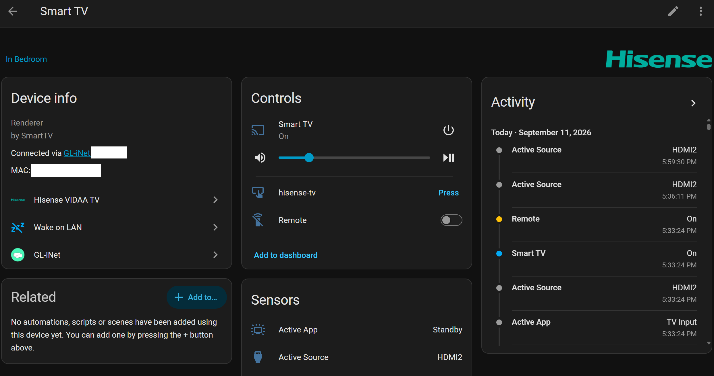

# Hisense VIDAA TV Integration for Home Assistant

[](https://github.com/hacs/default)
[](https://stevene1919.github.io/hisense_vidaa/)
[](https://github.com/stevene1919/hisense_vidaa/releases)
[](https://ko-fi.com/stevene_)
[](https://github.com/stevene1919/hisense_vidaa/actions/workflows/validate.yml)
[](https://github.com/stevene1919/hisense_vidaa/actions/workflows/lint.yml)

[](https://my.home-assistant.io/redirect/hacs_repository/?owner=stevene1919&repository=hisense_vidaa&category=integration)

A native Home Assistant integration for Hisense smart TVs running VIDAA OS.

Connects **directly** to the TV's internal MQTT broker (TLS port `36669`) using client certificates, providing local push updates, media controls, app launching, Wake-on-LAN, and remote control without external bridges or cloud dependencies.

<p align="center">
  
</p>

<p align="center">
  <a href="https://ko-fi.com/stevene_">
    
  </a>
</p>

---

## 🧭 Supported Generations & Models

The integration automatically detects and supports multiple generations of Hisense smart TVs:

| TV Generation / Firmware | Profile | Auth Model | Pairing Method |
| :--- | :--- | :--- | :--- |
| **Modern VIDAA OS (2024+ / U6+, U7 / protocol $\ge 3290$)** | `modern` | **Modern VIDAA 2.0** (64-bit XOR mask + modern salt) | 4-Digit Screen PIN |
| **Middle VIDAA OS (VIDAA 1.5 / protocol $3000 \le v < 3290$)** | `middle` | **Middle VIDAA** (64-bit XOR mask + standard salt) | 4-Digit Screen PIN |
| **Standard VIDAA OS (2018–2023 / U4, U5, early U6 / protocol $< 3000$)** | `remotenow` | **RemoteNOW Dynamic** (`his$<timestamp>` + standard salt) | 4-Digit Screen PIN |
| **Legacy Hisense / Older Models (Pre-2022 / U2, U3)** | `legacy` | **Legacy Static** (`hisenseservice` / `multimqttservice`) | Instant Setup (No PIN) |
| **Auto Detection (All Generations)** | `auto` | **Intelligent UPnP transport detection + multi-tier fallback cascade** | Automatic |

---

## ✨ Features

- **100% Local LAN Control (`iot_class: local_push`)**: Connects directly to the TV's hardware MQTT broker over your local network with **zero cloud dependencies**, zero external API calls, and full support for isolated IoT VLANs (WAN blocked). All cryptographic authentication logic is implemented in **100% native Python** with zero compiled binary dependencies.
- **Local Push Updates**: Instant feedback for power state, volume, mute, source input, and active app.
- **Media Player Platform**: Full power toggle, volume stepping, input source switcher, dynamic app artwork, deep linking, and configurable media transport controls. Exposes `MediaPlayerDeviceClass.TV` for native Apple HomeKit and iOS Control Center virtual remote integration.
- **Dedicated Remote Platform**: Fast key command dispatching, key aliases (`home`, `menu`, `back`, `ok`, etc.), configurable repeat counts, and inter-key delay options.
- **Picture & Display Adjustments (`number` & `select`)**: Fine-tune Backlight, Brightness, and Contrast slider entities (0–100) and switch Picture Modes (`Standard`, `Cinema Day`, `Cinema Night`, `Dynamic`, `Sports`, `Game`, `Filmmaker Mode`) dynamically.
- **Sound Mode Selector (`select`)**: Switch real-time TV sound equalizer modes (`Standard`, `Theatre`, `Music`, `Speech`, `Late Night`, `Sports`) and audio output routing (`select.{tv}_audio_output`).
- **On-Screen Toast Notifications (`notify`)**: Send customized on-screen toast messages and alert banners directly to the TV screen via `notify.send_message`.
- **Direct Text Input (`send_text_input` service)**: Inject virtual keyboard text directly into on-screen search bars and input fields across apps.
- **Rich Diagnostic Sensors**: Active source (with dynamic HDMI-CEC device naming), active Smart TV app, audio output mode, MQTT connection state, and session status.
- **Network Resilience**: Subnet-directed Wake-on-LAN with dual-MAC fallback (Ethernet + Wi-Fi) for reliable power-on from deep standby, clock synchronization via UPnP, and automatic 30-day token refresh.
- **Flexible SSL Handling**: Automatic in-memory extraction for PKCS#12 bundles (`.p12` / `.pfx`) and support for standard PEM pairs (`.pem`, `.crt`, `.key`) stored in `/config/ssl`.
- **Tabbed Options Flow**: Beautiful, categorized options menu (General & Power, Sources & Media, Remote Key Timings, SSL Certificates) for adjusting settings without re-pairing.

---

## 🚀 Installation & Setup

### Step 1: Install the Integration Files

You can install the integration either via **HACS** (easiest) or **Manually** (without HACS).

#### Option A: Install via HACS (Recommended)

Click the button below to add this repository directly to your HACS installation:

[](https://my.home-assistant.io/redirect/hacs_repository/?owner=stevene1919&repository=hisense_vidaa&category=integration)

*Or manually in HACS:* **HACS** $\rightarrow$ **Integrations** $\rightarrow$ **Custom repositories** $\rightarrow$ Add `https://github.com/stevene1919/hisense_vidaa` (Category: *Integration*).

---

#### Option B: Manual Installation

Download the latest [release ZIP](https://github.com/stevene1919/hisense_vidaa/releases/latest) and extract `custom_components/hisense_vidaa` into your Home Assistant `/config/custom_components/` directory.

---

### Step 2: Place Certificate Files

Copy your client certificate / key (or `.p12` bundle) to `/config/ssl/` (or `/ssl/` / `/config/certs/`).

> For certificate formats, filename matrix, and automatic extraction, see the **[SSL Certificate Guide](docs/certificates.md)**.

### Step 3: Pair Your TV

1. **Restart Home Assistant** (`Settings` $\rightarrow$ `System` $\rightarrow$ `Restart`).
2. Go to **Settings $\rightarrow$ Devices & Services $\rightarrow$ Add Integration** and search for **Hisense VIDAA TV**.
3. Enter your TV's IP address and select `Auto Detect (Recommended)`.
4. Enter the 4-digit PIN displayed on your TV screen to complete setup.

> [!TIP]
> **Recommended TV Settings**:
> To ensure your TV remains responsive in standby and avoids losing paired tokens when connected HDMI devices (e.g. Chromecast, Apple TV, PC) sleep, refer to the **[TV Power, Standby & Network Settings Guide](docs/power_and_standby_settings.md)**.

---

## 📚 Detailed Documentation & Guides

For deep technical details, guides, and dashboard templates, refer to the dedicated documentation:

| Document | Description |
| :--- | :--- |
| ⚡ **[TV Power, Standby & Network Settings](docs/power_and_standby_settings.md)** | Optimal TV settings across VIDAA versions (U4–U8, 2024+), two-tier standby architecture, and preventing token loss. |
| 📱 **[Lovelace Remote Cards & Dashboards](docs/lovelace_cards.md)** | Pixel-accurate Australian EN2G30H 12-app remote, Classic FTA, Button Card, and Android TV Card templates. |
| 🖼️ **[Screenshots & UI Gallery](docs/screenshots.md)** | Full visual tour of device controls, media player dialogs, source dropdowns, and option flows. |
| 🔒 **[SSL Certificate Setup](docs/certificates.md)** | Certificate filename matrix, PKCS#12 extraction, and root CA verification. |
| 🌐 **[Network & Wake-on-LAN Requirements](docs/network_requirements.md)** | 100% local LAN architecture, static DHCP setup, IoT VLAN configuration, and reliable wired WoL guidelines. |
| 🛠️ **[Services & Automation Examples](docs/services_and_automations.md)** | Full YAML automation examples, picture/sound adjustments, `hisense_vidaa.send_text_input`, and button cards. |
| 🧪 **[CLI Testing & Diagnostic Tools](docs/cli_tools.md)** | Standalone [`test_client.py`](test_client.py) and [`debug_tv.py`](debug_tv.py) command-line utility reference. |
| 🔬 **[Protocol & Cryptographic Architecture](docs/protocol_architecture.md)** | Deep-dive reverse engineering: XOR masks, dynamic hashes, token lifecycles, and MQTT topic dictionary. |

---

## 🛠️ Diagnostics & Troubleshooting

The integration includes diagnostic CLI tools ([`test_client.py`](test_client.py) & [`debug_tv.py`](debug_tv.py)) to test network connectivity, probe TV capabilities, and generate pre-formatted report blocks for GitHub issues.

### Running the Diagnostic Tool

```bash
# Option A: From any PC or server (recommended):
git clone https://github.com/stevene1919/hisense_vidaa.git
cd hisense_vidaa
pip install paho-mqtt defusedxml cryptography pytest
python3 test_client.py probe --ip <TV_IP>

# Option B: Inside Home Assistant (Terminal / SSH Addon):
cd /config
curl -sSL https://raw.githubusercontent.com/stevene1919/hisense_vidaa/main/test_client.py -o test_client.py
python3 test_client.py probe --ip <TV_IP>
```

### Common Commands

```bash
# Generate a complete diagnostics report with feature probing for GitHub issues:
python3 test_client.py report --ip <TV_IP> --probe

# Probe picture, sound, installed apps, and input sources:
python3 test_client.py probe --ip <TV_IP>

# Quick 3-tier connectivity & firmware detection probe:
python3 test_client.py ping --ip <TV_IP>
```

---

## ⚡ Integration Actions & Services

The integration provides custom Home Assistant actions for advanced automation and remote control (see **[Services & Automations Guide](docs/services_and_automations.md)** for full YAML examples):

| Action | Description | Key Parameters |
| :--- | :--- | :--- |
| `hisense_vidaa.send_key` | Sends navigation, playback, and numerical remote key commands. | `key`, `repeat`, `delay` |
| `hisense_vidaa.launch_app` | Launches installed smart TV applications by display name or app ID. | `app` |
| `hisense_vidaa.set_picture_setting` | Direct hardware adjustment of TV picture mode settings. | `menu_id`, `menu_value` |
| `hisense_vidaa.set_sound_setting` | Direct hardware adjustment of TV sound and equalizer settings. | `menu_id`, `menu_value` |
| `hisense_vidaa.send_text_input` | Sends text strings directly to active onscreen search boxes. | `text`, `action` |

---

## 🗑️ Removal & Uninstallation

To cleanly remove the Hisense VIDAA TV integration:

1. **Delete Config Entry**:
   - Go to **Settings $\rightarrow$ Devices & Services $\rightarrow$ Integrations**.
   - Find your **Hisense VIDAA TV** card, click the three dots (`⋮`) menu, and select **Delete**.
   - Persistent repair issues and entities associated with the device will be automatically cleaned up.
2. **Remove Certificates (Optional)**:
   - If you manually placed client certificates in `/config/ssl/hisense_vidaa/` (or `/config/ssl/`), remove those files if they are no longer needed by other tools.
3. **Uninstall Component**:
   - **HACS**: Go to **HACS $\rightarrow$ Integrations**, locate **Hisense VIDAA TV**, click the three dots (`⋮`) menu, and select **Remove**.
   - **Manual**: Delete the directory `/config/custom_components/hisense_vidaa/`.
4. **Restart Home Assistant**:
   - Restart Home Assistant (`Settings` $\rightarrow$ `System` $\rightarrow$ `Restart`) to release all loaded modules.

---

## 📋 Roadmap & Backlog

See [`TODO.md`](TODO.md) for active development items, planned enhancements, and feature requests.

---

## ☕ Support the Project

If this integration makes your smart home better or saved you hours of troubleshooting, consider supporting continued reverse-engineering, maintenance, and new features:

<p align="center">
  <a href="https://ko-fi.com/stevene_" target="_blank">
    
  </a>
</p>

---

## 🤝 Credits & Acknowledgments

This integration builds upon foundational reverse-engineering research by the open-source smart home community:

* **Nika Gerson Lohman ([@nikagl](https://github.com/nikagl))**: Pioneer of the dynamic RemoteNOW PIN challenge flow and `hisense.py`.
* **[@Krazy998](https://github.com/Krazy998) & Contributors**: MQTT protocol research on `mqtt-hisensetv`.
