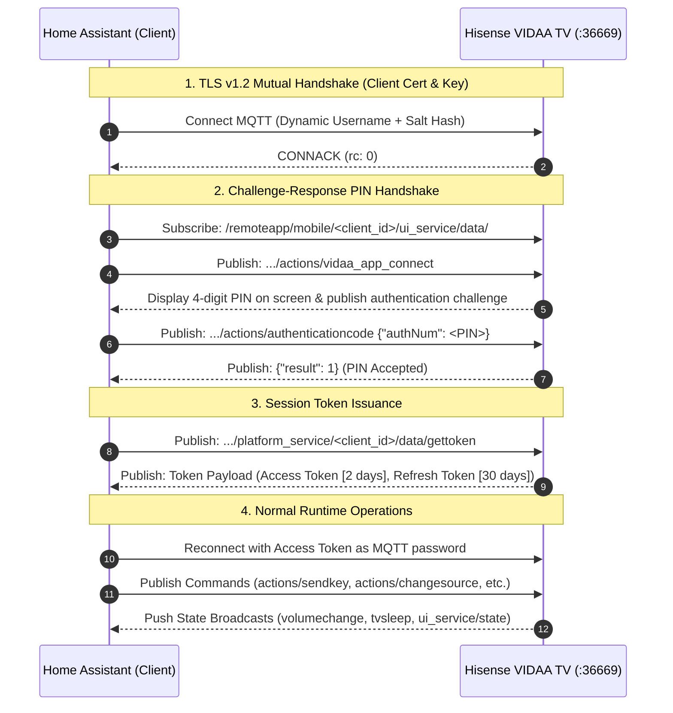
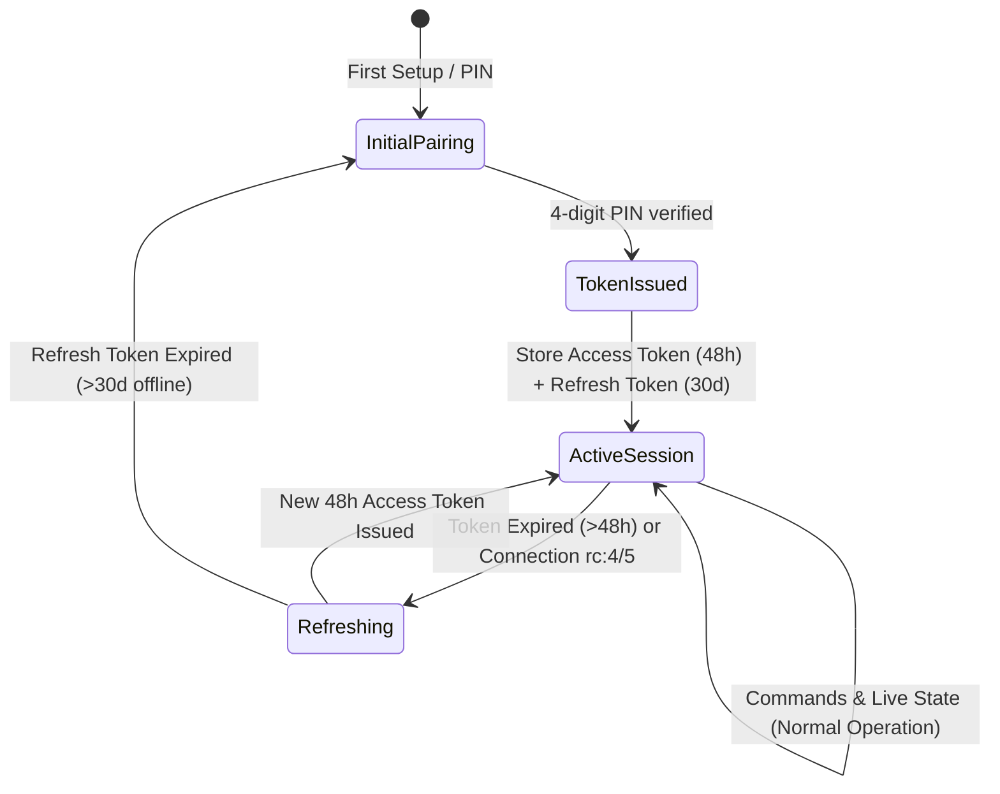

# 🔬 VIDAA Protocol & Cryptographic Architecture

This document provides a comprehensive technical breakdown of the Hisense VIDAA OS MQTT communication protocol, reverse-engineered from `libmqttcrypt.so` and the official VIDAA / RemoteNOW Android applications.

---

## 🧭 Communication Overview

Hisense smart TVs running VIDAA OS host an internal MQTT broker listening on TLS port `36669`. Communication requires mutual TLS with client certificates and a challenge-response pairing sequence.

---

## 🔐 Multi-Tier Authentication Models

The TV's internal MQTT broker (`libmqttcrypt.so`) enforces structured client credentials during initial pairing across four firmware generations:

### 🟢 1. Modern VIDAA 2.0 (VIDAA U6+, U7, 2024+ Models / Protocol $\ge 3290$)
- **Pattern:** `PATTERN = "38D65DC30F45109A369A86FCE866A85B"`
- **Client ID:** `f"{mac}$his${md5(f'{PATTERN}${mac}')[:6]}_vidaacommon_001"`
- **Username:** `f"his${timestamp ^ 6239759785777146216}"` *(XOR 64-bit constant `0x5698_1477_2b03_a968`)*
- **Cross-Sum:** `sum_digit = sum(int(d) for d in str(timestamp)) % 10`
- **Modern Salt:** `h!i@s#$v%i^d&a*a` *("hisvidaa")*
- **Password Hash:** `md5(f"{timestamp}${md5(f'his{sum_digit}h!i@s#$v%i^d&a*a')[:6]}").upper()`

### 🔵 2. Middle VIDAA 1.5 (VIDAA U5 / U6 Transition / Protocol $3000 \le v < 3290$)
- **Client ID:** `f"{mac}$his${md5(f'{PATTERN}${mac}')[:6]}_vidaacommon_001"`
- **Username:** `f"his${timestamp ^ 6239759785777146216}"` *(XOR 64-bit constant `0x5698_1477_2b03_a968`)*
- **Standard Salt:** `h*i&s%e!r^v0i1c9` *("hiserv0i1c9")*
- **Password Hash:** `md5(f"{timestamp}${md5(f'his{sum_digit}h*i&s%e!r^v0i1c9')[:6]}").upper()`

### 🟡 3. Standard RemoteNOW (VIDAA U4, early U5 / Protocol $< 3000$)
- **Client ID:** `f"{mac}$his${md5(f'{PATTERN}${mac}')[:6]}_vidaacommon_001"`
- **Username:** `f"his${timestamp}"` *(Plain Unix timestamp in seconds)*
- **Standard Salt:** `h*i&s%e!r^v0i1c9` *("hiserv0i1c9")*
- **Password Hash:** `md5(f"{timestamp}${md5(f'his{sum_digit}h*i&s%e!r^v0i1c9')[:6]}").upper()`

### ⚪ 4. Legacy Static (Pre-2022 / VIDAA U2, U3)
- **Username:** `hisenseservice`
- **Password:** `multimqttservice`
- **Pairing:** Bypasses PIN challenge; connects directly with static credentials.

### 🧠 Intelligent Auto-Detection & Fallback Cascade
When configured with `auth_profile: auto`:
1. The client queries the TV's UPnP descriptor (`rendererdevicedesc.xml`) across ports `38400` and `18400` to read `transport_protocol`.
2. Sets candidate profile order:
   - `protocol >= 3290`: `[modern, middle, remotenow]`
   - `3000 <= protocol < 3290`: `[middle, modern, remotenow]`
   - `protocol < 3000`: `[remotenow, middle, modern]`
3. If the broker rejects connection (`rc: 5` or `rc: 4`), the client automatically cascades through the fallback candidate list.
4. If dynamic profiles fail and the broker accepts static credentials, the client auto-selects `legacy`.

---

## ⏳ Session Token Lifecycle & Auto-Renewal

1. **Access Token (`accesstoken`):** Valid for **48 hours (2 days)**. Used directly as the MQTT password for all runtime commands and queries.
2. **Refresh Token (`refreshtoken`):** Valid for **30 days**. When the access token expires, the client connects to `platform_service/data/tokenissuance` using the refresh token to request a new access token without requiring a new PIN.

---

## 📡 MQTT Topic Hierarchy Reference

| Topic Path | Direction | Purpose |
| :--- | :--- | :--- |
| `/remoteapp/tv/ui_service/{client_id}/actions/vidaa_app_connect` | `Publish` | Initiate pairing handshake & trigger on-screen PIN |
| `/remoteapp/tv/ui_service/{client_id}/actions/authenticationcode` | `Publish` | Submit user-entered 4-digit PIN |
| `/remoteapp/tv/ui_service/{client_id}/actions/authenticationcodeclose` | `Publish` | Dismiss PIN modal on TV screen |
| `/remoteapp/tv/platform_service/{client_id}/data/gettoken` | `Publish` | Request initial access/refresh token pair |
| `/remoteapp/tv/remote_service/{client_id}/actions/sendkey` | `Publish` | Dispatch remote keypress (e.g. `KEY_POWER`, `KEY_HOME`) |
| `/remoteapp/tv/ui_service/{client_id}/actions/changesource` | `Publish` | Switch input source (`{"sourceid": "HDMI1", "sourcename": "HDMI1"}`) |
| `/remoteapp/tv/ui_service/{client_id}/actions/launchapp` | `Publish` | Launch installed Smart TV application (`{"appId": "...", "name": "..."}`) |
| `/remoteapp/tv/ps_service/{client_id}/actions/changevolume` | `Publish` | Set absolute volume level (`0`–`100`) |
| `/remoteapp/mobile/{client_id}/ui_service/data/authentication` | `Subscribe` | Receive TV pairing challenge response |
| `/remoteapp/mobile/{client_id}/platform_service/data/tokenissuance` | `Subscribe` | Receive issued / refreshed authentication tokens |
| `/remoteapp/mobile/broadcast/ui_service/state` | `Subscribe` | Real-time push notifications for TV power and UI state |
| `/remoteapp/mobile/broadcast/platform_service/actions/volumechange`| `Subscribe` | Real-time push notifications for volume and mute changes |
| `/remoteapp/mobile/broadcast/ui_service/volume` | `Subscribe` | Secondary broadcast topic for volume changes |
| `/remoteapp/mobile/{client_id}/ui_service/data/sourcelist` | `Subscribe` | Response containing available physical inputs |
| `/remoteapp/mobile/{client_id}/ui_service/data/applist` | `Subscribe` | Response containing installed Smart TV applications |
| `/remoteapp/tv/platform_service/{client_id}/actions/picturesetting` | `Publish` | Query picture menu (`get_menu_info`) or update parameter (`notify_value_changed`) |
| `/remoteapp/tv/platform_service/{client_id}/actions/soundsetting` | `Publish` | Query sound menu (`get_menu_info`) or update EQ preset (`notify_value_changed`) |
| `/remoteapp/tv/ui_service/{client_id}/actions/txtinputdata` | `Publish` | Inject text into active input field (`{"text": "...", "action": "insert"}`) |
| `/remoteapp/tv/ui_service/{client_id}/actions/bwsinputdata` | `Publish` | Inject text into web browser address / search bar |
| `/remoteapp/mobile/{client_id}/platform_service/data/picturesetting` | `Subscribe` | Response containing picture menu tree & active picture parameters |
| `/remoteapp/mobile/{client_id}/platform_service/data/soundsetting` | `Subscribe` | Response containing sound menu tree & active equalizer parameters |
| `/remoteapp/mobile/broadcast/platform_service/data/picturesetting` | `Subscribe` | Broadcast state push when picture mode or brightness changes on TV |
| `/remoteapp/mobile/broadcast/platform_service/data/soundsetting` | `Subscribe` | Broadcast state push when sound mode or audio setting changes on TV |
| `/remoteapp/mobile/{client_id}/ui_service/data/capability` | `Subscribe` | TV capabilities descriptor (e.g. notifications/toast support) |

---

## 🔑 Certificate Architecture & Extraction

The TV broker validates client connections using mutual TLS (mTLS v1.2/v1.3). The integration ships with pre-configured certificate profiles extracted from official mobile companion apps:

1. **`vidaa_2024` (VIDAA 2.0 / Modern)**: Extracted from the modern VIDAA Android client (`com.vidaa.smarttv`).
2. **`remotenow_2018` (RemoteNOW / Standard)**: Extracted from the RemoteNOW Android client (`com.hisense.tv.remotenow`).
3. **PKCS#12 (`.p12` / `.pfx`) Dynamic Extraction**:
   - The integration contains automated PKCS#12 unpackers using `cryptography.hazmat.primitives.serialization.pkcs12`.
   - Automatically tests known manufacturer keystore passwords (e.g. `186e990688070325a1c4b0ce275d2388`, `remote`, `hisense`, empty) to extract `.pem` key/cert pairs on the fly.

---

## 🔬 Capability Probing & Model Quirks

Different VIDAA models expose varying subsets of the MQTT protocol depending on regional licensing and mainboard chipset:

1. **Picture & Sound Settings (`/actions/picturesetting`, `/actions/soundsetting`)**:
   - Sending `{"action": "get_menu_info"}` requests the full menu JSON hierarchy (picture modes, backlights, contrast, EQ presets).
   - Supported TVs return populated menu trees with numeric `menu_id` identifiers.
   - Unsupported models return an empty payload `{}` or ignore the topic.
   - *Firmware Quirk (2024+)*: Unprompted background queries during boot can trigger an on-screen TV prompt on select firmware revisions. Probing is therefore gated during initial setup (PIN verification) or explicitly invoked via the diagnostic probe button.

2. **Sound Mode Dynamic Exposure**:
   - Home Assistant's `MediaPlayerEntityFeature.SELECT_SOUND_MODE` and `sound_mode_list` are dynamically attached only when the TV actively returns sound equalizer options.

3. **Audio-Only / Screen-Off Control**:
   - VIDAA OS does not expose a dedicated MQTT status query topic for display panel power state.
   - The integration provides an opt-in switch entity mapping to display power toggling on models supporting panel sleep.
