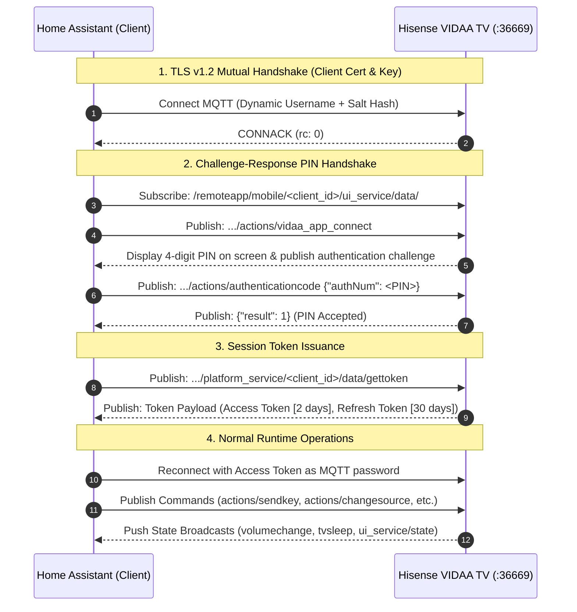
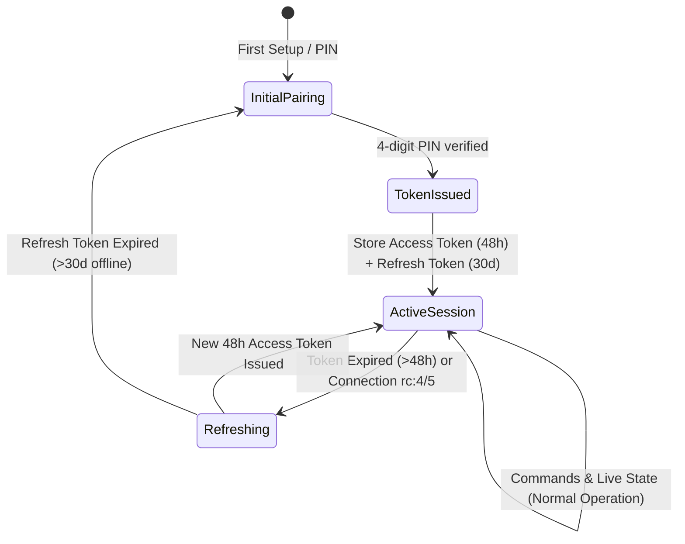

# 🔬 VIDAA Protocol & Cryptographic Architecture

This document provides a comprehensive technical breakdown of the Hisense VIDAA OS MQTT communication protocol, reverse-engineered from `libmqttcrypt.so` and the official VIDAA / RemoteNOW Android applications.

---

## 🧭 Communication Overview

Hisense smart TVs running VIDAA OS host an internal MQTT broker listening on TLS port `36669`. Communication requires mutual TLS with client certificates and a challenge-response pairing sequence.

---

## 🔐 Multi-Tier Authentication Models

The TV's internal MQTT broker (`libmqttcrypt`) enforces a strict client ID whitelist format during initial pairing: `${mac}$his${md5_prefix}_vidaacommon_001`. The suffix must be `_vidaacommon_001` or the connection is rejected (`rc: 2`).

### 🟢 1. Generation 2: Modern VIDAA 2.0 (`libmqttcrypt.so` / Firmware `Q0704`+)
- **Pattern:** `PATTERN = "38D65DC30F45109A369A86FCE866A85B"`
- **Client ID:** `f"{mac}$his${md5(f'{PATTERN}${mac}')[:6]}_vidaacommon_001"`
- **Username:** `f"his${timestamp ^ 6239759785777146216}"` *(XOR 64-bit mask `0x5689ab4102ef1908`)*
- **Cross-Sum:** `sum_digit = sum(int(d) for d in str(timestamp)) % 10`
- **Modern Salt:** `h!i@s#$v%i^d&a*a` *("hisvidaa")*
- **Password Hash:** `md5(f"{timestamp}${md5(f'his{sum_digit}h!i@s#$v%i^d&a*a')[:6]}").upper()`

### 🟡 2. Generation 1: RemoteNOW (Standard / Firmware `P1027` and older)
- **Client ID:** `f"{mac}$his${md5(f'{PATTERN}${mac}')[:6]}_vidaacommon_001"`
- **Username:** `f"his${timestamp}"`
- **Standard Salt:** `h*i&s%e!r^v0i1c9` *("hiserv0i1c9")*
- **Password Hash:** `md5(f"{timestamp}${md5(f'his{sum_digit}h*i&s%e!r^v0i1c9')[:6]}").upper()`

### ⚪ 3. Generation 0: Legacy Static (Pre-2022)
- **Username:** `hisenseservice`
- **Password:** `multimqttservice`
- **Pairing:** Bypasses PIN challenge; connects directly with static credentials.

---

## ⏳ Session Token Lifecycle & Auto-Renewal

1. **Access Token (`accesstoken`):** Valid for **48 hours (2 days)**. Used directly as the MQTT password for all runtime commands and queries.
2. **Refresh Token (`refreshtoken`):** Valid for **30 days**. When the access token expires, the client connects to `platform_service/data/tokenissuance` using the refresh token to request a new access token without requiring a new PIN.

---

## 📡 MQTT Topic Hierarchy Reference

| Topic Path | Direction | Purpose |
| :--- | :--- | :--- |
| `/remoteapp/tv/ui_service/{client_id}/actions/vidaa_app_connect` | `Publish` | Initiate pairing handshake & trigger on-screen PIN |
| `/remoteapp/tv/ui_service/{client_id}/actions/authenticationcode` | `Publish` | Submit user-entered 4-digit PIN |
| `/remoteapp/tv/ui_service/{client_id}/actions/authenticationcodeclose` | `Publish` | Dismiss PIN modal on TV screen |
| `/remoteapp/tv/platform_service/{client_id}/data/gettoken` | `Publish` | Request initial access/refresh token pair |
| `/remoteapp/tv/remote_service/{client_id}/actions/sendkey` | `Publish` | Dispatch remote keypress (e.g. `KEY_POWER`, `KEY_HOME`) |
| `/remoteapp/tv/ui_service/{client_id}/actions/changesource` | `Publish` | Switch input source (`{"sourceid": "HDMI1", "sourcename": "HDMI1"}`) |
| `/remoteapp/tv/ui_service/{client_id}/actions/launchapp` | `Publish` | Launch installed Smart TV application (`{"appId": "...", "name": "..."}`) |
| `/remoteapp/tv/ps_service/{client_id}/actions/changevolume` | `Publish` | Set absolute volume level (`0`–`100`) |
| `/remoteapp/mobile/{client_id}/ui_service/data/authentication` | `Subscribe` | Receive TV pairing challenge response |
| `/remoteapp/mobile/{client_id}/platform_service/data/tokenissuance` | `Subscribe` | Receive issued / refreshed authentication tokens |
| `/remoteapp/mobile/broadcast/ui_service/state` | `Subscribe` | Real-time push notifications for TV power and UI state |
| `/remoteapp/mobile/broadcast/platform_service/actions/volumechange`| `Subscribe` | Real-time push notifications for volume and mute changes |
| `/remoteapp/mobile/broadcast/ui_service/volume` | `Subscribe` | Secondary broadcast topic for volume changes |
| `/remoteapp/mobile/{client_id}/ui_service/data/sourcelist` | `Subscribe` | Response containing available physical inputs |
| `/remoteapp/mobile/{client_id}/ui_service/data/applist` | `Subscribe` | Response containing installed Smart TV applications |
