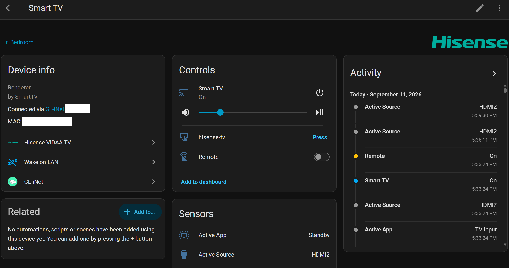
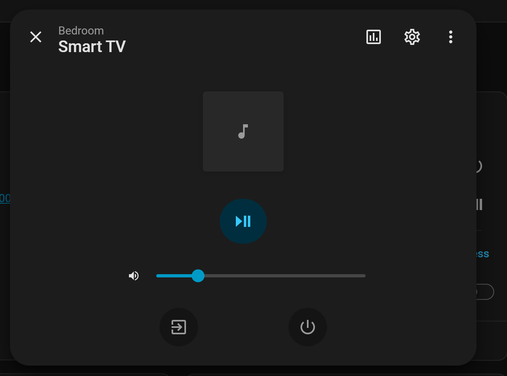
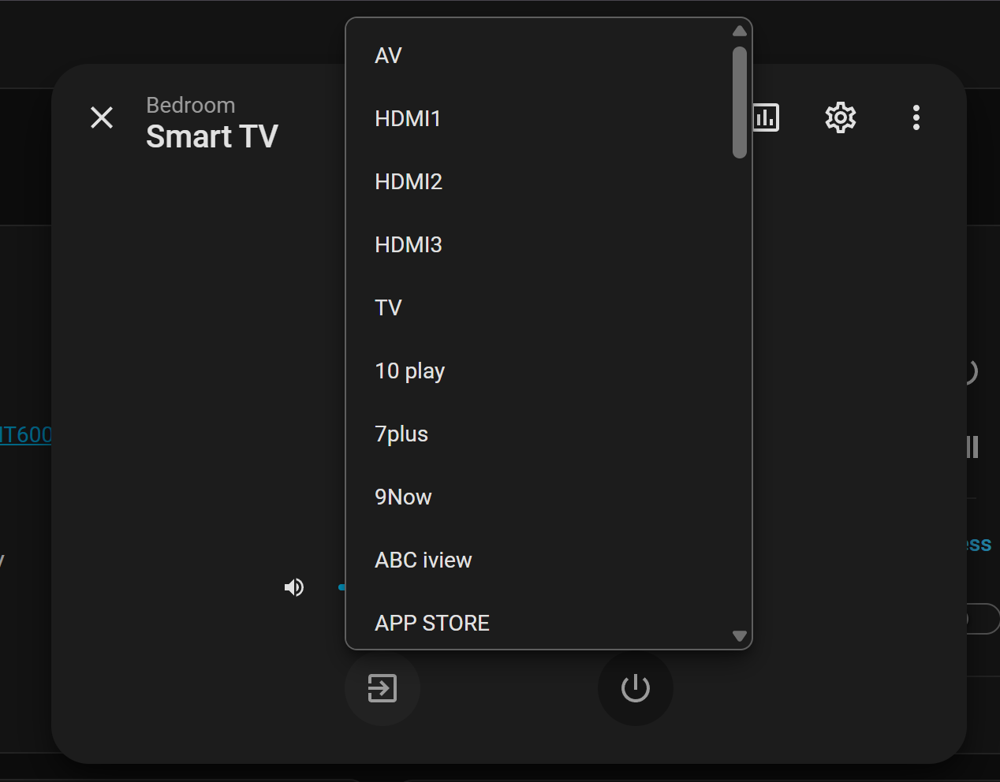
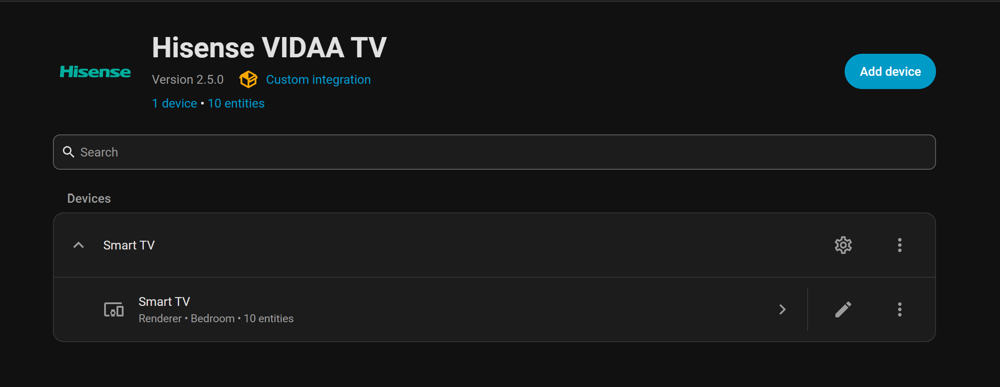
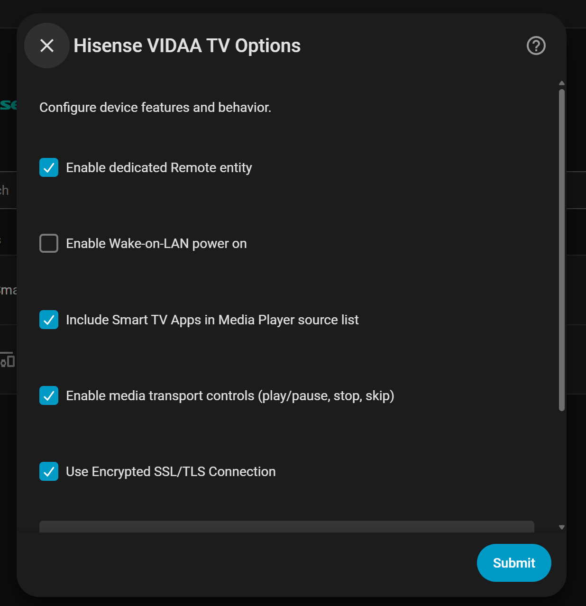
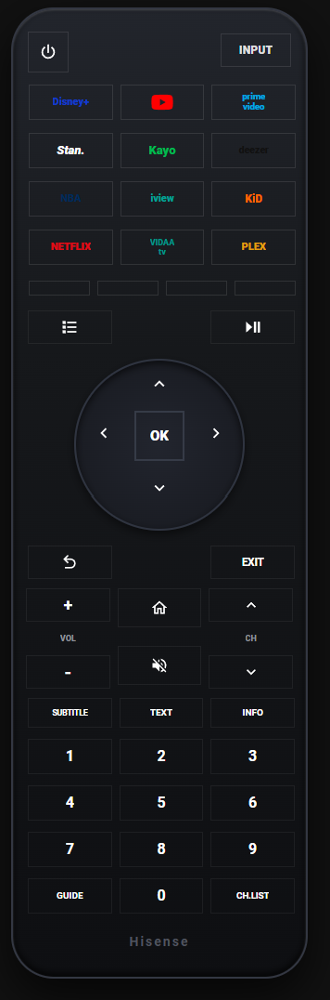

# 🖼️ Screenshots & UI Gallery

This gallery showcases the Hisense VIDAA TV integration interface, device pages, controls, and entity dialogs across Home Assistant.

---

## 🖥️ Device Overview & Controls

The primary device overview page displaying media controls, power state, input selector, active app sensor, audio output routing, diagnostic sensors, and utility buttons:

  

---

## 🎵 Media Player Entity & Input Sources

### Media Player Card & Controls

  

### Input Source & Smart TV App Selector

  

---

## ⚙️ Integration & Options Flow

### Integrations Dashboard View

  

### Configurable Options Dialog
Configure Wake-on-LAN, media transport controls, app listing in sources, remote entity generation, and SSL mode without re-pairing:

  

---

## 🇦🇺 Lovelace Australian Remote Control (EN2G30H)

Pixel-accurate digital recreation of the physical Australian 12-app remote control using `custom:button-card`:

  

> [!TIP]
> To set up the Australian Remote or explore other remote templates (Classic FTA, Android TV Card, etc.), see the **[Lovelace Remote Cards & Dashboard Guide](lovelace_cards.md)**.
